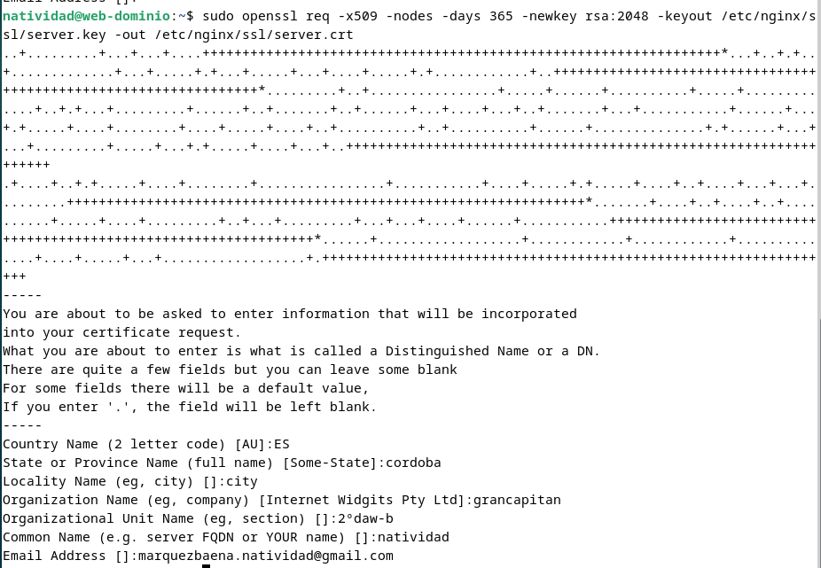
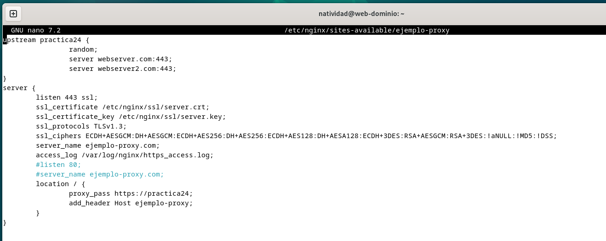
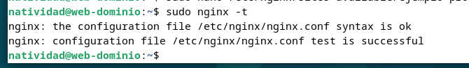
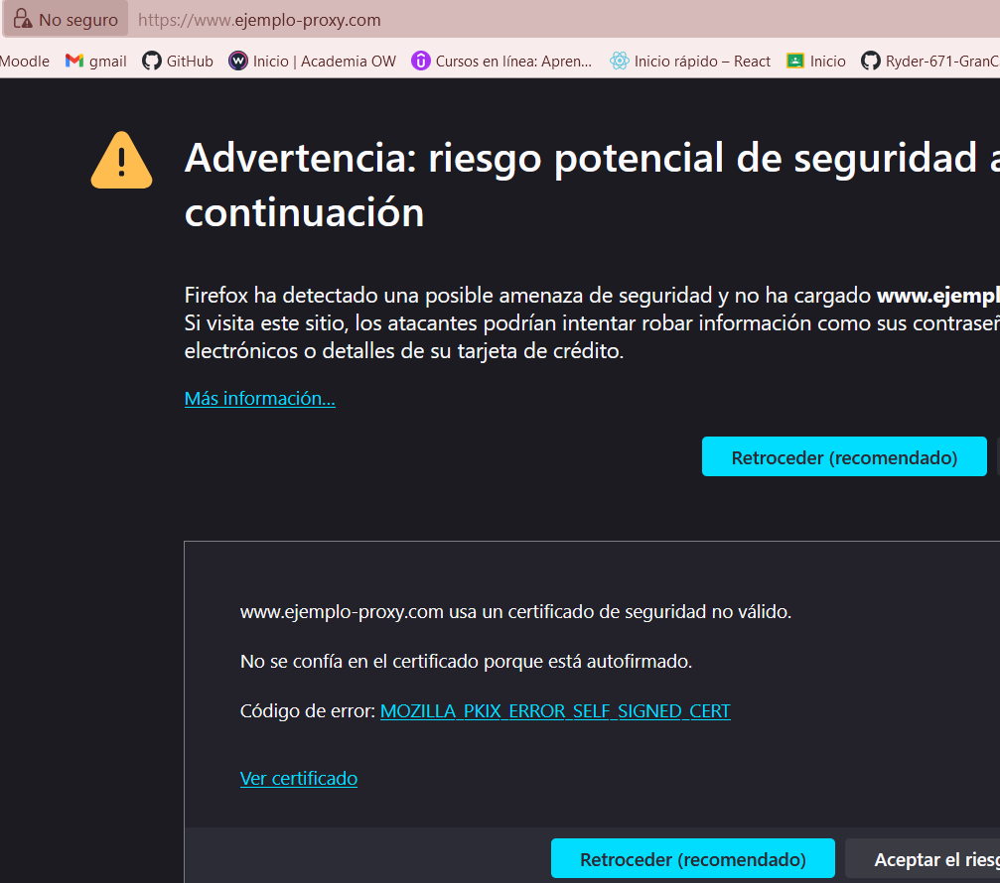
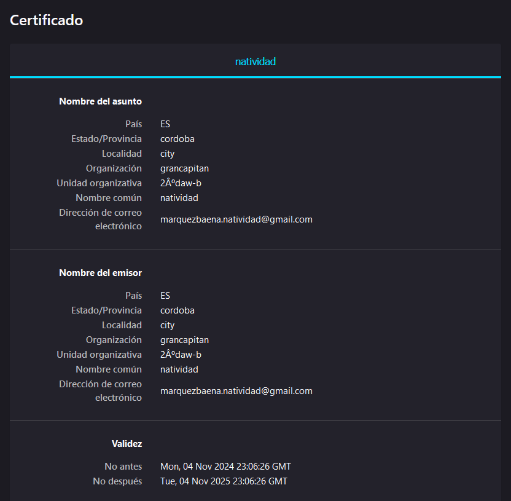
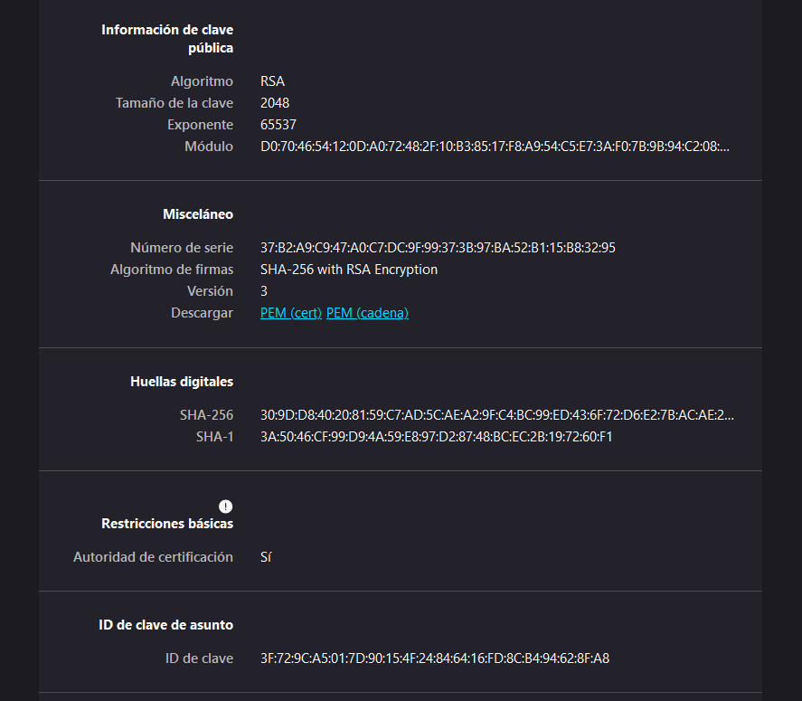
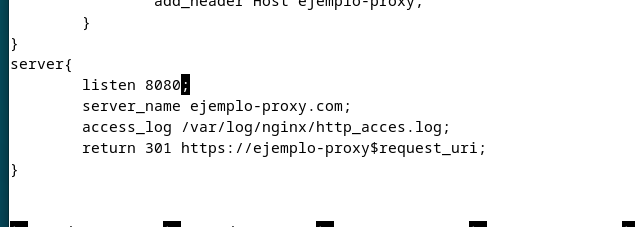

Natividad Márquez Baena

# Practica 2.5 - Proxy inverso y balanceo de carga con SSL en NGINX

1.INTRODUCCIÓN
2.TAREA
3.COMPROBACIONES

## 1.INTRODUCCIÓN
En la práctica anterior se configuraró un proxy inverso con balanceo de carga entre dos servidores web Nginx. En esta  se implementará la configuración de SSL para el cifrado HTTPS. El proxy inverso actúa como intermediario entre los clientes y los servidores, ofreciendo la ventaja de realizar el cifrado y descifrado de SSL, lo que reduce la carga en los servidores web. Se generará un certificado autofirmado mediante la herramienta OpenSSL, simulando el entorno seguro.

## 2.TAREA
### 2.1 Crear un Certificado Autofirmado
Se crea un directorio para el certificado llamado ssl en la ruta `/etc/nginx/`.

Se genera el certificado y la clave privada con OpenSSL mediante el siguiente comando (valido por un año):

Descripción de los parámetros:
`x509:` Crea un certificado autofirmado.
`nodes:` No solicita contraseña, permitiendo el acceso directo del servidor.
`days 365:` Validez del certificado en días.
`newkey rsa:2048:` Genera una nueva clave RSA de 2048 bits.
`keyout y -out` Define la ruta de salida para la clave y el certificado, respectivamente

Se rellenará la información que solicita el certificado durante el proceso.

### 2.2  Configuración SSL en el Proxy Inverso
Primero se edita el archivo de configuración del proxy en el directorio `/etc/nginx/sites-available`:

Aquí se modifica el bloque server para habilitar el https. Se cambia la configuración para que el proxy escuche en el puerto 443 (HTTPS) y use el certificado y la clave creados.

`listen 443 ssl;`: Configura el servidor para escuchar en el puerto 443, activando SSL.

`ssl_certificate y ssl_certificate_key:` Ubicación del certificado y la clave privados generados.

`ssl_protocols y ssl_ciphers:` Establecen protocolos y algoritmos de cifrado seguros.

`access_log:` Especifica el nombre y ubicación del archivo de logs para HTTPS.

Una vez hecho se realiza un test para comprobar que el archivo se ha modificado correctamente y la sintaxis es válida. Además se reinicia el servicio nginx para aplicar los cambios al archivo de configuración.

## 3.COMPROBACIONES

### 3.1 Acceder al sitio mediante HTTPS

 Se accede al sitio web y debería aparecer una advertencia de seguridad, ya que se trata de un certificado autofirmado.
 
 
 
 A continuación se revisa el certificado y los datos 
 
 
 

### 3.2  Forzar la Redirección de HTTP a HTTPS

 Se añade un bloque server adicional para redirigir HTTP a HTTPS. Para ello se modifica el archivo anterior y se
 añade el siguiente bloque:

Como en anteriores pasos, se comprueban que los cambios son correctos y se reinicia el servicio nginx.
Finalmente, al redirigirnos a la misma página, debería redirigirse automáticamente a la versión segura https.

